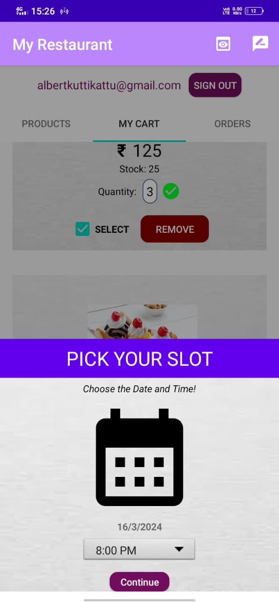

# My-Restaurant Application
My-Restaurant is a mobile application that is developed to automate all restaurant activities, such as food ordering and parking.

# Technology Used:
Android Studio 
Java 
Firebase (Realtime Database, Authentication, Storage, etc.)

# Requirements
Download and install Android Studio IDE. 
Open the Firebase Console at https://console.firebase.google.com/, register for an account and add a new project (my project is called `albert`) 
Configure our Android Studio project using Firebase SDK, Firebase Authentication, and Realtime Database. Then, connect the Android app to the Firebase project. 
Login credentials for Admin: `albertsebastian75@gmail.com`, password:`Albert@123` (The published Android app requires Firebase authentication in order to log in).

# My-Restaurant
My-Restaurant is a mobile application developed to automate every aspect of a restaurant, including parking and meal ordering. This application is offered to replace the issues that are active manually and make things simpler so that customers don’t have to wait a long time for the meal to be prepared and served. 	The client can reserve anything on the whole menu of the restaurant with this application. Stakeholders in the My-Restaurant application include managers, customers, and employees. The employees include chefs, supervisors, parking attendants, and waiters. The products are organized by categories to make it simple for customers to find what they need. Customers can order for the required products using the search box as well. 

The staff must register in order to log into the application. The registration request is received by the admin panel, and they must wait for approval. They can log in to the application and begin working after gaining approval. The staffs are able to see the specifics of customer orders. The administrator can manage staff, customer, and employee accounts, view orders and parking, add and manage product data, etc. Customers have the option of signing up by providing their contact information or logging in with a Google account. They can use their own login information to book the orders and to provide feedback.  

The primary goal of putting in place is to encourage customers to purchase more food products. Therefore in this project, I introduce an efficient and user-friendly smart My-Restaurant Application. This application solves key problems faced by restaurants today through the use of technologies. Restaurants have much inefficiency due to human limitations that can be resolved through automation and device-to-device communication. My-Restaurant application accomplishes this by providing two interfaces for the two types of users in restaurants, a mobile application for customers and for restaurant staff members. With capabilities like ordering food from an interactive menu, finding parking spots, and finding vacant tables at the restaurant more conveniently, the mobile application enables consumers to enjoy a flawless dining experience.

# Modules
1. Login And Sign Up Module 
2. Items Module 
3. Users Module 
4. Order Module 
5. Staff Module 
6. Cart Module 
7. Table Module 
8. Parking Module

# About Me

Albert Sebastian 
albertsebastian75@gmail.com 
8590956627 
Kerala, India

# Screenshots
<table align="center">
    <tr>
      <td align="center"></td>
      <td align="center"></td>
      <td align="center"></td>
    <tr>
      <td align="center"></td>
      <td align="center"></td>
      <td align="center"></td>
    </tr>
    <tr>
      <td align="center"></td>
      <td align="center"></td>
      <td align="center"></td>
    <tr>
      <td align="center"></td>
      <td align="center"></td>
      <td align="center"></td>
    </tr>
    <tr>
      <td align="center"></td>
      <td align="center"></td>
      <td align="center"></td>
    <tr>
      <td align="center"></td>
      <td align="center"></td>
      <td align="center"></td>
    </tr>
    <tr>
      <td align="center"></td>
      <td align="center"></td>
      <td align="center"></td>
    <tr>
      <td align="center"></td>
      <td align="center"></td>
    </tr>
  </table>
  